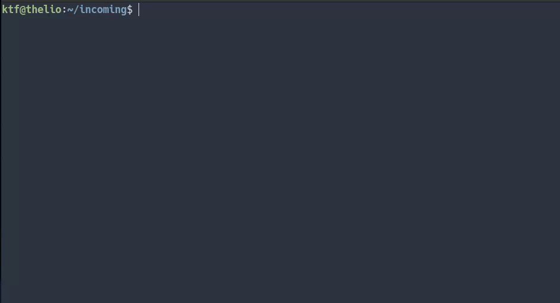

# tvmv

A command-line tool to bulk-rename TV episode files with minimal fuss.

Integrates with [TMDB](https://www.themoviedb.org/). Uses API data to
automatically rename your files to something human- and media-server-friendly.
(For Plex, Jellyfin, Kodi, &c.)

```
$ tvmv mv -n buffy
```

That's all there is to it!




## Table of Contents

* [Quickstart / Demo](#quickstart--demo)
* [Overview / Features](#overview--features)
* [Installation](#installation)
  + [Binary installation](#binary-installation)
  + [Building from source](#building-from-source)
* [Using tvmv](#using-tvmv)
  + [tvmv commands](#tvmv-commands)
     * [mv](#mv)
        + [mv mode 1: Autodetect the season/episode numbers](#mv-mode-1-autodetect-the-seasonepisode-numbers)
        + [mv mode 2: Specify a show name and season number](#mv-mode-2-specify-a-show-name-and-season-number)
        + [Which mode should I use?](#which-mode-should-i-use)
        + [TV show name autodetection](#tv-show-name-autodetection)
     * [undo](#undo)
        + [Log files](#log-files)
     * [search](#search)
  + [A note on the mv command and show-matching](#a-note-on-the-mv-command-and-show-matching)
  + [Multi-language subtitle files](#multi-language-subtitle-files)
  + [Other options](#other-options)
     * [-f, --force](#-f---force)
     * [-u, --unicode-filenames](#-u---unicode-filenames)
  + [API key location](#api-key-location)
  + [Configuration / Customization?](#configuration--customization)
* [Known limitations](#known-limitations)
  + [Multi-episode files](#multi-episode-files)
  + [Multiple episode orderings](#multiple-episode-orderings)
  + [Recursively traversing directories](#recursively-traversing-directories)
* [Running tests](#running-tests)
* [FAQ](#faq)
  + [What exactly does tvmv do?](#what-exactly-does-tvmv-do)
  + [What's with the name?](#whats-with-the-name)
  + [Is there a GUI?](#is-there-a-gui)
  + [How is this different from [bulk-rename tool X]?](#how-is-this-different-from-bulk-rename-tool-x)
  + [What about FileBot?](#what-about-filebot)
  + [Sonarr/Radarr?](#sonarrradarr)
  + [I use Windows and I'm getting "invalid character" errors](#i-use-windows-and-im-getting-invalid-character-errors)
  + [How can I rename files for all of a show's seasons at once?](#how-can-i-rename-files-for-all-of-a-shows-seasons-at-once)


## Quickstart / Demo

First download the latest release for your platform from [the releases
page](https://github.com/keithfancher/tvmv/releases). With that out of the
way...

```
# Let's check out a season of a show we ripped:
$ cd ~/rips/poirot/season12

# Who named these files? Super-annoying :(
$ ls -1
'Ep1.mp4'
'Ep2.mp4'
'Ep3.mp4'
'Ep4.mp4'

# One command later...
$ tvmv mv -n poirot -s 12

# ...ahh, much better!
$ ls -1
"Agatha Christie's Poirot - s12e01 - Three Act Tragedy.mp4"
"Agatha Christie's Poirot - s12e02 - Hallowe'en Party.mp4"
"Agatha Christie's Poirot - s12e03 - Murder on the Orient Express.mp4"
"Agatha Christie's Poirot - s12e04 - The Clocks.mp4"
```


## Overview / Features

`tvmv` is a minimal, zero-config command-line tool to bulk-rename your ripped
or (legally!) downloaded TV episode files. It has sane defaults, talks to a
sane API, and produces useful filenames that are human- and
media-server-friendly.

- [x] Easily rename episode files, subtitles, or any other type of file using
  data from [TMDB](https://www.themoviedb.org/).
- [x] Produce useful, human-readable filenames which are also compatible with
  Plex, Jellyfin, Kodi, and most other media servers.
- [x] Search for shows right from the command-line.
- [x] Write portable filenames: Windows-friendly, Mac-friendly, and (of
  course!) Linux-friendly.
- [x] Autodetect season/episode numbers and show names in filenames.
- [x] Autodetect language metadata in subtitle filenames.
- [x] Easy to install: a single binary file with no external dependencies.
- [x] Support for Linux, Mac OS, and Windows.
- [x] Free and open source!


## Installation

You've got two options:

1. Installing a binary
   [release](https://github.com/keithfancher/tvmv/releases). The
   quick-and-easy route.
2. Building from source. Not recommended unless you need a particular
   cutting-edge feature that isn't included in the latest binary release. (But
   don't worry: building isn't *complicated*. It's just *slow*.)

More details below.

### Binary installation

If you've downloaded [a binary
release](https://github.com/keithfancher/tvmv/releases), you can simply
extract the `tvmv` executable somewhere in your `PATH`. No installation
process is required.

To uninstall, simply remove the binary.

(Note: At the moment, `tvmv` MacOS binaries are built for Intel Macs. If
you're using an Apple Silicon machine, you'll need to install Rosetta
(`softwareupdate --install-rosetta`) or you'll get "bad CPU type" errors.)

### Building from source

We use `stack` as our build tool. You can [install it
directly](https://docs.haskellstack.org/en/stable/install_and_upgrade/#install-stack)
or via [GHCup](https://www.haskell.org/ghcup/), whatever floats your boat.

Once you've got `stack` installed, navigate to the root of the `tvmv` project
directory (where the `package.yaml` file is located), and `stack build`:

```
$ cd tvmv
$ stack build
$ stack install
```
By default, this installs the `tvmv` binary into `~/.local/bin`. You may need
to add this directory to your `PATH`. (Or just put the binary wherever you
like. There are no ancillary files to worry about.)


## Using tvmv

The "Quickstart" section above should get you pretty far. But there are a few
other things to mention.

### tvmv commands

`tvmv` has three commands: `mv`, `search`, and `undo`. You must specify one of
these commands to actually *do* anything.

For help with a given command, you can use `tvmv [COMMAND] -h`. For example,
to learn more about `mv`:

```
$ tvmv mv -h
```

Let's take a closer look at each command.

#### mv

This is the Main Thing, the "mv" in "tvmv". Renames (moves) your files. Users
of any Unix-like OS will recognize the name.

Here are some basic examples to get you started:

```
# Rename all files in current directory, using data for "Buffy", season 4:
$ tvmv mv -n buffy -s 4

# Do the same thing, but auto-detect the season and episode number(s):
$ tvmv mv -n buffy

# And better yet, auto-detect *everything* from the input files, including the
# show's name:
$ tvmv mv

# The exact same operation again, but using Buffy's unique ID rather than a
# name query. This ID can be fetched with the `tvmv search` command, or
# directly from a search on the TMDB site.
$ tvmv mv -i 95

# This time, let's do season 1. And we're specifying a directory instead of
# using the current working directory:
$ tvmv mv -n buffy -s 1 ~/tv/buffy/s1

# This time, globbing for specific files -- subtitles! Note that tvmv doesn't
# care whether it's renaming episodes, subtitles, or whatever else.
$ tvmv mv -n buffy -s 1 ~/tv/buffy/s1/*srt
```

Note that the `mv` command has **two modes of operation**.

1. **tvmv autodetects the season/episode numbers**. This is the default mode,
   and will be used unless...
2. **User specifies a show name and season number** using the `-n` and `-s`
   flags, respectively.

Read on to understand more about the pros/cons of each mode.

##### mv mode 1: Autodetect the season/episode numbers

"Smart mode". (Added in version `0.3.0`.)

This is generally the most flexible, least painful option. However, **it
requires file names which already contain season and episode numbers** in a
standard format (e.g. `s03e23` or `3x23`).

If this is the case for your files, simply pass them to `tvmv mv`. Here's a
quick example. Note that here, we're still specifying the *show name* with the
`-n` flag, though we could have left it off and `tvmv` would have
[autodetected it](#tv-show-name-autodetection) from the third file:

```
$ ls -1 poirot/
12x4.mkv
1x1.pilot.encoded.by.MEGA.KEWL.TEAM.LOLZ.mkv
'poirot s04e03.mkv'

$ tvmv mv -n poirot poirot/

$ ls -1 poirot/
"Agatha Christie's Poirot - s01e01 - The Adventure of the Clapham Cook.mkv"
"Agatha Christie's Poirot - s04e03 - One, Two, Buckle My Shoe.mkv"
"Agatha Christie's Poirot - s12e04 - The Clocks.mkv"
```

Note that `tvmv` will simply ignore files which it can't parse season/episode
data from. Convenient!

##### mv mode 2: Specify a show name and season number

"Dumb mode".

The user specifies a show name and season number (e.g. `-n poirot -s 7`) and
`tvmv`, without any processing of the filenames at all, sorts the files
lexicographically, then applies the API data to each file **in that order**.

This mode requires you to operate on only **a single season at a time**. It
also requires you to operate on **a full, contiguous season**. If you attempt
to operate on too few or too many files in this mode, `tvmv` will (by default)
throw an error. (This behavior can be changed with the `-p` flag, which allows
partial matches. Use at your own peril!)

If your files do *not* contain standard-format season/episode numbers already,
you must use this mode.

Note that you can run into trouble if your files don't (lexicographically)
sort correctly. For example, if you have files whose episode numbers aren't
zero-padded, the sorting can go wrong, e.g.:

```
ep1.mp4
ep10.mp4
ep2.mp4
```

In this case, you'll have to zero-pad the episode numbers for `tvmv` to work
correctly. (Or fix the filenames to be usable with the "auto-detect" mode.)

##### Which mode should I use?

**Do your file names contain season and episode numbers already**, in a
standard format like `s03e23` or `3x23`? If so, just use the autodetect mode.
It's more flexible, and can operate on non-contiguous files from arbitrary
seasons.

Otherwise, you'll need to specify a show name and season number with `-n` and
`-s`, and can only operate over contiguous episodes from a single season at a
time.

##### TV show name autodetection

As of version `0.6.0`, `tvmv` can autodetect TV show names as well as episode
and season numbers. This feature is still in "beta" and currently uses a very
simple method to extract the name: it must come before the season/episode
numbers in at least *one* of the input files.

Note that it doesn't even have to be the exact show name -- any TMDB search
string that will yield the correct show as its first result will work.

For example, look at these three (poorly named) files:

```
$ ls -1
2x5.mkv
4x8.mkv
'thrones 1x1.mkv'

$ tvmv mv
User API key override not detected, using tvmv's default API key
Parsed out show name: 'thrones'
Fetching episode data from API for seasons 1, 2, 4
Preparing to execute the following 3 rename operations...

2x5.mkv ->
Game of Thrones - s02e05 - The Ghost of Harrenhal.mkv

4x8.mkv ->
Game of Thrones - s04e08 - The Mountain and the Viper.mkv

thrones 1x1.mkv ->
Game of Thrones - s01e01 - Winter Is Coming.mkv

Continue? (y/N)
```

Nice!

#### undo

The `undo` command will undo the `mv` operations that you just ran, resetting
your files. It depends on a `tvmv` log file sitting in your current directory.

```
# This will undo the most recent `mv` operation:
$ tvmv undo

# Same idea here, but let's specify a specific tvmv log file rather than using
# the most recent one:
$ tvmv undo tvmv-log-123456.txt
```

What are these log files, you ask? Read on!

##### Log files

When you do an `mv` operation, `tvmv` will (by default) write a log of any
renamed files. (This is written to the *current* directory -- not necessarily
the directory where the files live.)

The sole purpose of this log file is to facilitate the `undo` command. It just
allows you to be a little more free-and-easy about renaming files. If you're
happy with the state of your files, simply delete the log.

Note that the file paths in the log files are absolute, so `undo` will work
even if you move the log file. It will **not** work, however, if you move the
TV episode files themselves.

If you don't want to write a log when using the `mv` command, simply pass the
`--no-log` flag (aka `-x`). You will *not* be able to use the `undo` command
without a log, however.

#### search

The `search` command searches TMDB for shows that match the given text query.
Fetches name, unique ID, and a little metadata about each result. For example:

```
# Searches TMDB for shows that match the query "buffy":
$ tvmv search buffy
```

The TMDB URL for each result will also be displayed, which can be handy to
quickly grab some more info about a result or verify it's the show you expect.

### A note on the `mv` command and show-matching

As you can see in the examples above, you can match a show on *either* its
name *or* its unique ID. If you match a show by name (using the `-n` flag of
the `mv` command or its show name autodetection), `tvmv` will use the
**first** match returned by the API for your query. This is the same order
that's returned by `tvmv search`, so you can preview the results if you like.
(And you will have a chance to confirm the rename before it happens, of
course.)

Luckily, TMDB's search is generally very sane. If you search for `buffy`, you
get back the right "Buffy" as the first result. Fragments are fine, too -- if
you search `thrones`, you get back "Game of Thrones". If you search `simps`,
you get back "The Simpsons", etc.

If you don't trust this behavior, or if you prefer something guaranteed to be
repeatable (or scriptable?), you can match a show by its unique ID using the
`-i` flag. As mentioned above, you can get a show's ID via `tvmv search`.

### Multi-language subtitle files

As of version `0.5.0`, `tvmv` supports multi-language subtitle files. Assuming
the language metadata in your filenames follows [the convention defined by
Plex](https://support.plex.tv/articles/200471133-adding-local-subtitles-to-your-media/#toc-3),
`tvmv` will maintain that metadata when it renames your files.

When using `tvmv`'s default "autodetect" mode, this all just works as expected
and doesn't require any extra effort on your part:

```
$ ls -1
'abfab - s02e03.de.srt'
'abfab - s02e03.en.sdh.forced.srt'
'abfab - s02e03.mp4'

$ tvmv mv -n "ab fab"
Fetching episode data from API for season 2
[etc, tvmv does its thing]

$ ls -1
'Absolutely Fabulous - s02e03 - Morocco.de.srt'
'Absolutely Fabulous - s02e03 - Morocco.en.sdh.forced.srt'
'Absolutely Fabulous - s02e03 - Morocco.mp4'
```

This also works when you're *not* able to use autodetect mode. However, for
the number of episodes to line up properly, you'll need to rename *only one*
set of subs at a time when not using autodetection. For example, consider the
following (poorly-named) files:

```
$ ls -1
'abfab 1.de.srt'
'abfab 1.en.srt'
'abfab 1.mp4'
'abfab 2.de.srt'
'abfab 2.en.srt'
'abfab 2.mp4'
```

The season/episode numbers can't be auto-detected in this case. Therefore we
must take three passes: one for each language (`en` and `de`) and one for the
episode files themselves (the `mp4` files). Here's what the first pass might
look like, targeting only the English subtitles:

```
$ tvmv mv -p -n "ab fab" -s 1 *en.srt
Fetching episode data from API for season 1
[etc, tvmv does its thing]

$ ls -1
'abfab 1.de.srt'
'abfab 1.mp4'
'abfab 2.de.srt'
'abfab 2.mp4'
'Absolutely Fabulous - s01e01 - Fashion.en.srt'
'Absolutely Fabulous - s01e02 - Fat.en.srt'

# Now again for German subs:
$ tvmv mv -p -n "ab fab" -s 1 *de.srt
[etc]
```

See the section on ["Dumb mode"](#mv-mode-2-specify-a-season-number) for more
details on its foibles and limitations.

### Other options

Other CLI options you should be aware of.

#### -f, --force

By default, `tvmv` will ask for user confirmation before making any file
changes. (This goes for both the `mv` and `undo` commands.) If you want to
skip this confirmation step, simply use the `-f` (or `--force`) command-line
option. (For example, `tvmv undo -f`.)

#### -u, --unicode-filenames

Allow the full unicode set of characters for filenames. By default, `tvmv`
produces more "portable" filenames.

`tvmv` uses API data to rename files, which means we can occasionally wind up
with some annoying filenames -- especially when the show data contains special
characters (dashes, "smart" quotes, etc). The Windows command-line in
particular tends to behave poorly in these cases, and can even [error out
entirely](#i-use-windows-and-im-getting-invalid-character-errors).

By default (as of version `0.6.0`), `tvmv` ensures that written files use a
more limited set of characters (ASCII, specifically) and that those filenames
will be valid (and less annoying to work with) on all three supported
operating systems: Windows, MacOS, and Linux. (Though again: Windows is really
the only problem-child here.)

Note that, regardless of whether the `-u` option is set, `tvmv` will *always*
ensure it's writing valid filenames for the operating system it's built for.
In other words, the Windows build of `tvmv` will always create valid Windows
filenames, the Linux build will create valid Linux filenames, etc.

### API key location

**As of version `0.6.0`, users are no longer required to sign up for their own
API keys!** 🎉

`tvmv` has its own default key, which should get the job done. That said, if
you're running into rate limits with the shared key or simply prefer to use
your own key, it's quick, free, and easy to so.

First, sign up on [TMDB](https://developer.themoviedb.org/docs/getting-started).
Request an API key from [your settings page](https://www.themoviedb.org/settings/api)
(you have to fill out a short form), and in a few seconds they should approve.

Now that you've got your key, there are three ways to pass it to `tvmv`:

1. Via the command line (the `-k` or `--api-key` options).
2. Via the `TMDB_API_KEY` environment variable.
3. Via a file: `$XDG_CONFIG_HOME/tvmv/tmdb-api-key`. (On most unix-like
   systems, that would resolve to: `~/.config/tvmv/tmdb-api-key`. On a Windows
   system, it would be something like
   `C:/Users/<user>/AppData/Roaming/tvmv/tmdb-api-key`. Note that if
   `$XDG_CONFIG_HOME` is not defined on your system, the above defaults will
   be used.)

Important note: `tvmv` will look for your API key in those locations **in that
order**. If you need to swap out API keys for a given run or a given terminal
session, it should be easy to override on the command line or with the
environment variable, respectively.

(I personally just stick my key in `~/.config/tvmv/tmdb-api-key` and forget
about it. Whatever works for you!)

### Configuration / Customization?

There isn't any! I'm banking on sane defaults here. If there's a demand, say,
for episode name templates or something, I'll think about adding them in. But
for now, it just does its thing.

That said: let me know if it doesn't work for your use-case! I built this
mostly with my own needs in mind.


## Known limitations

Stuff `tvmv` doesn't handle *yet*, but which is on my radar for future
releases.

### Multi-episode files

`tvmv` can not yet handle multi-episode files. Which is to say, if you have a
*single* file which contains *multiple* episodes, `tvmv` will simply fail to
parse that file. (Of course this only applies when using autodetect mode.
"Dumb mode" doesn't parse the filenames at all.)

The remaining files will still parse as expected. For example, with the
following three files, *one* of which is a double episode:

```
$ ls -1
'at - S07E14-E15.mkv'
'at - S07E16.mp4'
'at - S07E17.mp4'

Failed to parse season/episode numbers from the following files:
at - S07E14-E15.mkv

Fetching episode data from API for season 7
Preparing to execute the following 2 rename operations...

at - S07E16.mp4 ->
Adventure Time - s07e16 - Summer Showers.mp4

at - S07E17.mp4 ->
Adventure Time - s07e17 - Angel Face.mp4

Continue? (y/N)
```

Note that the `s07e14-e15` file did not parse, and therefore will *not* be
renamed. For now, the best bet is to rename double episodes manually.

### Multiple episode orderings

`tvmv` doesn't currently have a way to specify a preferred episode ordering.
For example, "DVD order" or "TV broadcast order". It will simply use TMDB's
default ordering.

### Recursively traversing directories

`tvmv` does not currently have an option to recursively traverse directories.
This is easy to work around in Linux and Mac OS (see [the related FAQ
item](#how-can-i-rename-files-for-all-of-a-shows-seasons-at-once)), but I
don't know of an easy workaround for Windows users.


## Running tests

There are two test suites: `unit` and `integration`. The following will run
them both, which is the default:

```
$ stack test
```

Or you can run either one individually:

```
$ stack test :unit
$ stack test :integration
```

The unit tests are pure and isolated, as you'd expect. The integration tests
will create and rename actual files on your actual file system (and then clean
up when they're done, of course).

Note that, despite being called "integration tests", they do *not* connect to
any real external API (and of course no API key is required). The
"integration" in this case is with the filesystem.

There are currently no (automated) full end-to-end tests, but I provided a bit
of test data to play with, e.g.:

```
$ stack build
$ stack exec tvmv -- mv -n poirot -s 12 test/data/
$ stack exec tvmv -- undo
```
Of course since these are real calls to the application, you *will* need an
API key for this.


## FAQ

### What exactly does tvmv do?

It fetches TV episode metadata from an API, then uses that metadata to
automatically rename TV episode files into a media-server-friendly (and
human-friendly) format.

### What's with the name?

`mv` (short for "move") is the command in Unix-like operating systems to
rename a file. And TV is TV :)

### Is there a GUI?

Nope, it's a command-line tool. It probably wouldn't be hard to build a GUI on
top of it, but that's not a priority for me. (Calling `tvmv mv -n buffy` is
quick and easy! That's really all there is to it.)

### How is this different from \[bulk-rename tool X\]?

Many folks have suggested tools like PowerRename and Bulk Rename Utility as
alternatives. Here's why these tools are different:

1. These are generic, pattern-based bulk-rename tools. They're great! But they
   don't automatically pull TV episode metadata from an API, which is what
   `tvmv` does.
2. Most of these tools are Windows-only. (I don't use Windows.)

### What about FileBot?

FileBot is super-cool. But it has a *ton* of features I don't use, need, or
want, and the functionality that I *do* want (pulling data from an API and
renaming files) isn't quite worth the price tag for me.

Also, I don't need a JRE to use `tvmv` ;)

### Sonarr/Radarr?

These tools are fantastic, and I highly recommend them if you need/want the
functionality they provide. But they are *way* overkill for my needs. To
install software like this simply to pull API data and rename files is... too
much! (For me, at least.)

### I use Windows and I'm getting "invalid character" errors

Windows support for Unicode in the command-line is dicey. See the ["Important
note for Windows users!"](https://github.com/keithfancher/kept#important-note-for-windows-users)
section in the readme for `kept`, another tool of mine, for a workaround.
See also [this StackOverflow
post](https://stackoverflow.com/questions/49476326/displaying-unicode-in-powershell/49481797#49481797)
for more details.

As of `tvmv` version `0.6.0`, writing Windows-friendly "portable" filenames is
the default, so these errors should be rare. However, they might still come up
if you're using the `-u`/`--unicode-filenames` option, or if special
characters appear in `tvmv search` results.

### How can I rename files for all of a show's seasons at once?

If you have several seasons of a show, with all the video files in the same
directory (*not* in subdirectories), you can simply use `tvmv`'s autodetect
mode (which is its default mode of operation anyway). In this mode, it will
happily rename episodes from different seasons all at once.

However, `tvmv` does not currently traverse subdirectories automatically. If
each season of your show is in its own subdirectory, your best bet is to use
tools like `find` and `xargs`. Note that the following is for Linux and MacOS
users only -- I don't know if there is a Windows equivalent:

```
# This is my directory structure: two directories, `s4` and `s12`, each with
# corresponding episodes inside.
$ find .
./s12
./s12/Poirot S12E1.mp4
./s12/Poirot S12E2.mp4
./s12/Poirot S12E3.mp4
./s12/Poirot S12E4.mp4
./s4
./s4/s4e1.mp4

# Now, with the help of `find` and `xargs`, we find all `mp4` files in these
# dirs and pass those files to `tvmv mv`:
$ find -name '*.mp4' -type f -print0 | xargs -0 tvmv mv -f

[ tvmv does its thing ]

# Et voila!
$ find .
./s12
./s12/Agatha Christie's Poirot - s12e01 - Three Act Tragedy.mp4
./s12/Agatha Christie's Poirot - s12e02 - Hallowe'en Party.mp4
./s12/Agatha Christie's Poirot - s12e03 - Murder on the Orient Express.mp4
./s12/Agatha Christie's Poirot - s12e04 - The Clocks.mp4
./s4
./s4/Agatha Christie's Poirot - s04e01 - The ABC Murders.mp4
```
